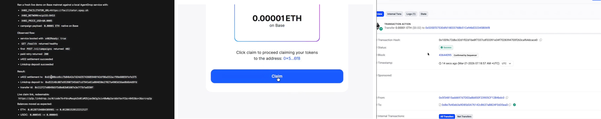

# AgentDrop

AgentDrop is an x402-enabled growth service for agent apps.

It helps developers solve activation, not just checkout: pay AgentDrop to create a funded claim link, share it with a target agent or user via text message or email, and sponsor their first paid onchain interaction.



This repo ships two layers:

- `agentdrop-service.js`: an Express service with an x402 paywall for campaign creation
- `linkdrop-agent.js`: a strict JSON CLI for the underlying Linkdrop send/claim primitive

## What It Does

- Accepts x402 payments for `POST /v1/campaigns`
- Creates claimable onchain credits using Linkdrop
- Defaults delivery to Base
- Keeps a strict JSON contract for automation
- Exposes free discovery endpoints for agents:
  - `/`
  - `/health`
  - `/agent.json`
  - `/.well-known/agent.json`
  - `/v1/capabilities`
  - `/v1/pricing`

## Supported Chains

The funding and claim primitive supports the chains available in the current `linkdrop-sdk` runtime:

- `base` (default)
- `polygon`
- `arbitrum`
- `optimism`
- `avalanche`

## Setup

1. Install dependencies:
   - `npm install`
2. Configure env vars from `.env.example`
3. Required env:
   - `PRIVATE_KEY` for the wallet that funds the claimable credit
4. Recommended env:
   - `RPC_URL_BASE` or `RPC_URL`
5. Optional service env:
   - `PORT` default `4021`
   - `X402_PAY_TO` default is the address derived from `PRIVATE_KEY`
   - `X402_NETWORK` default `eip155:84532`
   - `X402_PRICE_USD` default `$0.05`
   - `X402_FACILITATOR_URL` default `https://x402.org/facilitator`

## Run The Service

Start AgentDrop:

```bash
npm run service
```

On startup it prints one JSON object with the active x402 configuration.

The service attempts x402 initialization during startup. If the facilitator is unavailable, the free routes still boot and the paid route returns `503 X402_UNAVAILABLE` until the facilitator is reachable. The service re-attempts x402 initialization lazily on paid requests.

### Free routes

- `GET /`
- `GET /health`
- `GET /agent.json`
- `GET /.well-known/agent.json`
- `GET /v1/capabilities`
- `GET /v1/pricing`

### Paid route

- `POST /v1/campaigns`

Example request body:

```json
{
  "amount": "0.01",
  "token": "native",
  "chain": "base",
  "campaign": "signup bonus",
  "recipientType": "agent"
}
```

Successful response:

```json
{
  "ok": true,
  "product": "agentdrop_onboarding_credit",
  "request": {
    "campaign": "signup bonus",
    "recipientType": "agent",
    "amount": "0.01",
    "token": "native",
    "chain": "base"
  },
  "x402": {
    "network": "eip155:84532",
    "payTo": "0x...",
    "price": "$0.05"
  },
  "linkdrop": {
    "ok": true,
    "chain": "base",
    "claimUrl": "https://...",
    "transferId": "...",
    "depositTx": "0x..."
  }
}
```

If the request is unpaid or underpaid, the x402 middleware returns `402 Payment Required` with payment instructions.

## Test Run

There is not a one-command end-to-end test in the repo yet, but you can exercise the important paths locally.

### 1. Fast local checks

Syntax-check the service and CLI:

```bash
npm run check
```

Verify the CLI contract still prints JSON help:

```bash
npm run smoke:cli
```

### 2. Safe local service boot with a dummy key

This verifies boot, discovery routes, and degraded x402 behavior without funding a real transfer:

```bash
PRIVATE_KEY=0x1111111111111111111111111111111111111111111111111111111111111111 PORT=4022 npm run service
```

In another terminal:

```bash
curl -s http://127.0.0.1:4022/health
curl -s http://127.0.0.1:4022/.well-known/agent.json
curl -s http://127.0.0.1:4022/v1/pricing
```

Test the paid route shape:

```bash
curl -s -X POST http://127.0.0.1:4022/v1/campaigns \
  -H 'Content-Type: application/json' \
  -d '{"amount":"0.01","token":"native","chain":"base"}'
```

Expected result:

- If the facilitator is reachable and payment is missing, the route should return `402 Payment Required`.
- If the facilitator is not reachable, the route should return `503 X402_UNAVAILABLE`.

### 3. Real CLI transfer flow

Use a funded key and a real RPC:

```bash
export PRIVATE_KEY=0xYOUR_FUNDED_KEY
export RPC_URL_BASE=https://mainnet.base.org
node linkdrop-agent.js send --amount 0.0001 --token native --chain base
```

Then redeem the returned claim URL:

```bash
node linkdrop-agent.js claim --url "<claimUrl>" --to 0xRecipient --chain base
```

### 4. Real service flow

Set a funded key, a real RPC, and a reachable facilitator:

```bash
export PRIVATE_KEY=0xYOUR_FUNDED_KEY
export RPC_URL_BASE=https://mainnet.base.org
export PORT=4021
npm run service
```

Then:

- Check `GET /health` and confirm `x402Ready: true`.
- Send an unpaid `POST /v1/campaigns` request and confirm you get `402 Payment Required`.
- Pay that route with an x402-aware client and confirm you receive `claimUrl`, `transferId`, and `depositTx`.

This repo does not yet ship a dedicated x402 client smoke script, so the last step currently requires your own x402-capable client.

## Use The CLI Primitive

The CLI is still available for direct automation and debugging.

Print usage JSON:

```bash
node linkdrop-agent.js --help
```

Create a native-token claim link:

```bash
node linkdrop-agent.js send --amount 0.01 --token native --chain base
```

Create an ERC20 claim link:

```bash
node linkdrop-agent.js send --amount 5 --token 0xTokenAddress --chain polygon
```

Claim a transfer:

```bash
node linkdrop-agent.js claim --url "<claimUrl>" --to 0xRecipient --chain base
```

## CLI Output Contract

Every CLI invocation prints exactly one JSON object to stdout.

- Success: `{ "ok": true, ... }`
- Error: `{ "ok": false, "error": { "code": "...", "name": "...", "message": "...", "details": { ... } } }`

## Why This Exists

x402 solves how an agent gets paid.

AgentDrop solves how an agent gets its first customer. Instead of waiting for a new user or agent to arrive with a funded wallet, a service can create a claimable credit, bootstrap the wallet, and sponsor the first paid interaction.

## Hackathon Positioning

- Primary target: `Base - Agent Services on Base`
- Secondary target: `Synthesis Open Track`

Submission copy and registration notes live in [HACKATHON_PACKAGE.md](./HACKATHON_PACKAGE.md).
